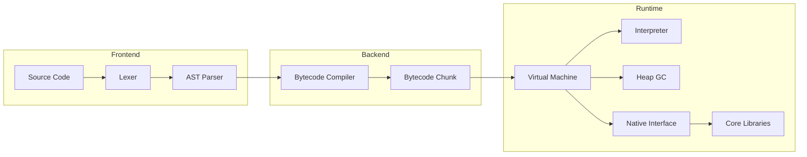

# Unnarize


**Unnarize** is a high-performance, embedded scripting language built for speed and reliability. It features a modern **"Gapless" Generational Garbage Collector**, native **Async/Await** support, and a lightweight bytecode VM, making it ideal for long-running embedded services or rapid prototyping.

---

## Key Features

### "Gapless" Garbage Collector
*   **Generational Heap**: Separates new objects (Nursery) from long-lived ones (Old Gen).
*   **Concurrent Marking**: Traces object graphs in a background thread.
*   **Parallel Sweeping**: Cleans up memory without "Stop-The-World" pauses.

### Native Async/Await
*   **`async` / `await`**: Syntactic sugar for handling `Future` objects.
*   **Event Loop**: Native implementation for I/O and background tasks.

### Optimization
*   **Computed Goto Dispatch**: Extremely fast instruction dispatching.
*   **Specialized Opcodes**: Optimized paths for integers, floats, locals.
*   **Zero Dependency**: Pure C (standard libc + pthreads).

---

## Performance Benchmarks

Tests performed on **11th Gen Intel(R) Core(TM) i5-1135G7 @ 2.40GHz** with 8GB RAM (Ubuntu 24.04).

### VM Compute Throughput
| Benchmark | Performance | Resource |
|-----------|-------------|----------|
| **Integer Arithmetic** | **~100 M ops/sec** | **Peak RAM:** ~11,460 KB |
| **Double Arithmetic** | **~90 M ops/sec** | |
| **String Concatenation** | **~30 K ops/sec** | |
| **Array Operations** | **~50 M ops/sec** | |
| **Struct Access** | **~40 M ops/sec** | |

### GC Stress Test
| Scenario | Load | Result |
|----------|------|--------|
| **Massive Allocation** | 50,000 Arrays | **Stable** (~11.4 MB) |
| **Long Running** | 15,000 Requests | **<10ms Pause** |

### ucoreString (Text Processing)
| Operation | Data Size | Ops/sec |
|-----------|-----------|---------|
| `contains` | 14 KB | **24.5 Million** |
| `toLower` | 14 KB | 42,500 |
| `replace` | 14 KB | 38,800 |
| `split` | 14 KB | 12,300 |
| `regex extract` | 14 KB | 2,600 |

### ucoreScraper (Web Scraping)
| Operation | Data Size | Ops/sec |
|-----------|-----------|---------|
| `parseFile` (class selector) | 370 KB | 339 |
| `parseFile` (table rows) | 370 KB | 212 |
| `select` (in-memory) | 370 KB | 128 |
| `parseFile` (links) | 370 KB | 83 |

### Benchmark Validation
To ensure high transparency and prevent overclaiming, every performance metric is backed by a verifiable benchmark execution.
*   **Proof of Work**: Latest validation run can be found in [languagebench/battle_report.txt](languagebench/battle_report.txt).
*   **Verification Hash**: Results are validated as of commit [`0c81196`](https://github.com/gtkrshnaaa/unnarize/blob/0c8119608447b5d49a42c623fd1b1d4cfd986f20/languagebench/battle_report.txt).

---

## Quick Start

### Build from Source
```bash
git clone https://github.com/gtkrshnaaa/unnarize.git
cd unnarize
make
```

### Run Demo
```bash
./bin/unnarize examples/testcase/main.unna
```

### Run Benchmarks
```bash
# VM Benchmark
./bin/unnarize examples/benchmark/benchmark.unna

# String Library Benchmark (run from directory)
cd examples/corelib/string && ../../../bin/unnarize benchmark.unna

# Scraper Library Benchmark (run from directory)
cd examples/corelib/scraper && ../../../bin/unnarize benchmark.unna
```

---

## Language Tour

### Generational GC
```javascript
for (var i = 0; i < 10000; i = i + 1) {
    var temp = ["data", i]; // Allocated in Nursery, swept instantly
}
print("Done without leaks!");
```

### Async/Await
```javascript
async function fetchData(url) {
    return "Response from " + url;
}

async function main() {
    var result = await fetchData("api.example.com");
    print(result);
}
main();
```

### Structs
```javascript
struct User { id; name; email; }
var u = User(1, "Alice", "alice@example.com");
print(u.name); // "Alice"
```

---

## Core Libraries

| Library | Description |
|---------|-------------|
| `ucoreString` | Text manipulation: `split`, `join`, `replace`, `regex` |
| `ucoreScraper` | HTML parsing & CSS selectors, web scraping |
| `ucoreJson` | JSON parsing and serialization |
| `ucoreHttp` | HTTP Server/Client (`listen`, `get`, `post`) |
| `ucoreSystem` | Shell execution, environment variables |
| `ucoreTimer` | High-precision timing |
| `ucoreUon` | Parser for UON data format |

---

## Architecture



---

## License

MIT License. Created by **gtkrshnaaa**.